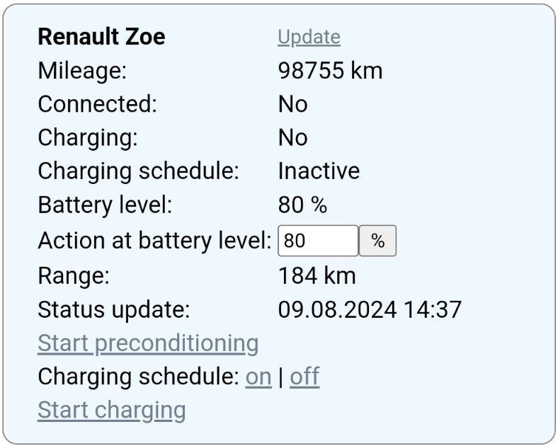
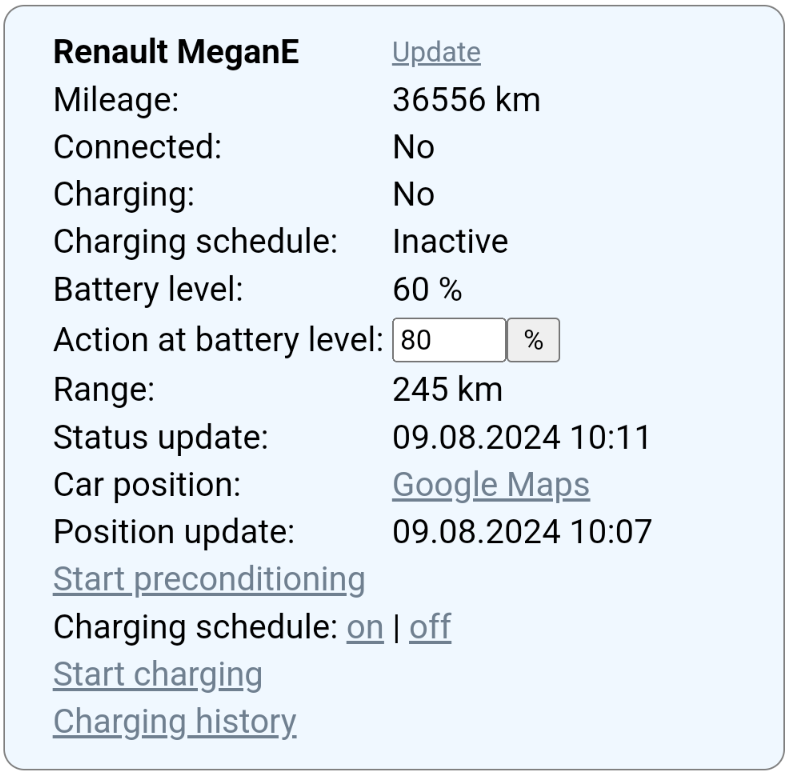

# ZoePHP
Unofficial PHP client for the Renault Zoe.

## Requirements
* Renault Zoe with active data subscription
* Webserver with PHP 5.3 (or newer) and cURL installed
* Write permissions for the script in its own folder

## Usage instructions
* Add a file "config-private.php" to the folder that contains index.php
* If you work from github, make sure "config-private.php" is in .gitignore (should be already)
* Add the below block to config-private.php and edit accordingly before you run the script for the first time
```
//Name for your Renault Zoe (shows as heading)
$zoename = 'Renault Zoe';

//Your Renault Zoe model: 1 for Ph1 or 2 for Ph2
$zoeph = 1;

//Login to My Renault
$username = 'your@mailadress.com';
$password = 'My_password';

//VIN of your Renault Zoe
$vin = 'VF1...';

//Save data in database.csv: Y for yes or N for no
$save_in_db = 'N';

//Send mail if battery level is reached: Y for yes or N for no
$mail_bl = 'N';

//Send mail if charging is finished: Y for yes or N for no
$mail_csf = 'N';

//Using cron: Request index.php?cron or php ../index.php cron
//Minimum time interval in minutes between two requests if the car isn't charging
$cron_ncs = 60;
//Minimum time interval in minutes between two requests if the car charging
$cron_acs = 15;

//openweathermap.org API key for requesting weather data (only Ph2)
//More information: https://openweathermap.org/appid
$weather_api_key = '';

//Registration country of your Renault Zoe
$country = 'DE';

```
* Adjust the settings in config.php if required.
* When calling the script for the first time it creates a "session" file. This file is used for caching your account id, token, car data and so on. Please delete this file after every update of the script.
* When you activate the database function the script will create "database.csv" as database file for all data records. You can import this file into Microsoft Excel, for example. For saving your car's data regulary you can run the script periodically, for example with cron.
* If it wasn't possible to receive new data from Renault you will see a notice together with cached data.
* You can activate two simple mail notifications when running the script periodically: When 1) a specified battery level is reached and/or 2) charging is finished.
* When you call the script periodically using "index.php?cron" or "php index.php cron" you can set how often the Renault API is called (charging/not charging), regardless how often the script itself is called.
* Thanks to @ToKen for the openweathermap.org integration for Ph2-Zoes! If you want to use this feature you need an API key from openweathermap.org.
* Give a big hand also to [Muscat's OxBlog](https://muscatoxblog.blogspot.com/2019/07/delving-into-renaults-new-api.html) for decrypting the Renault API.
* For security reasons I recommend to secure the script with basic authentication or other access restrictions.

## Screenshots
Ph1 | Ph2
------------ | -------------
 | 
